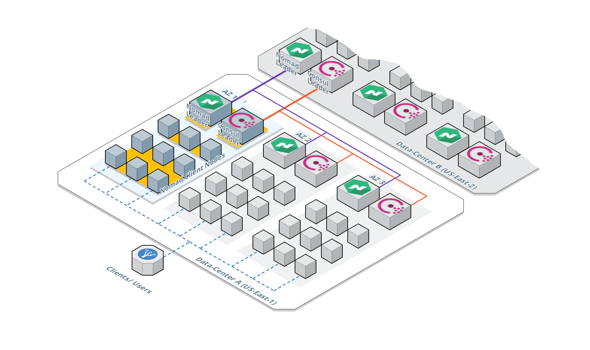
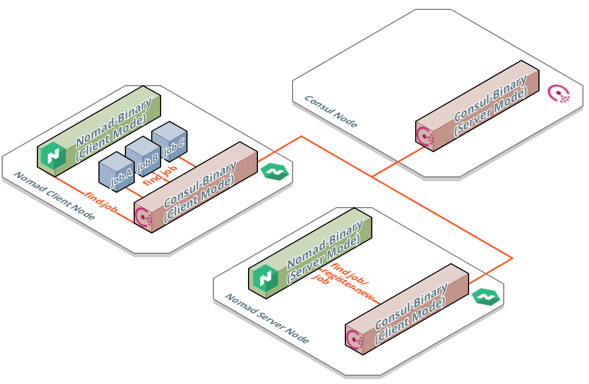
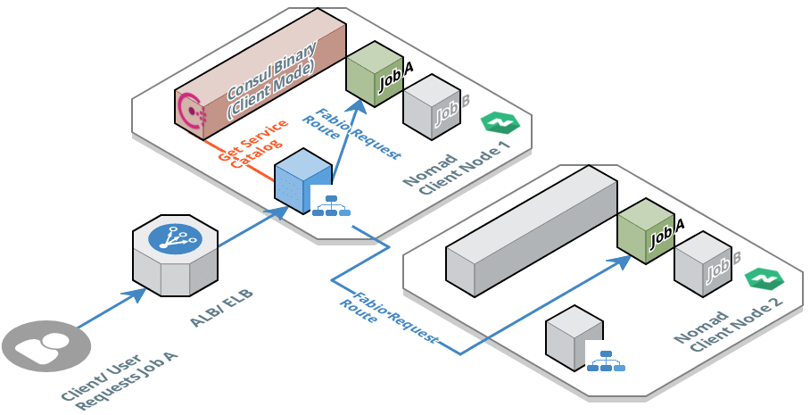
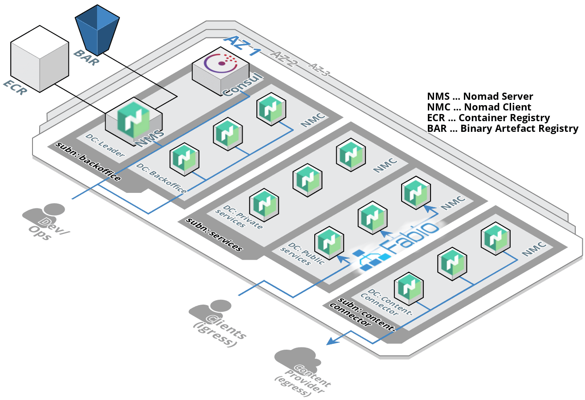
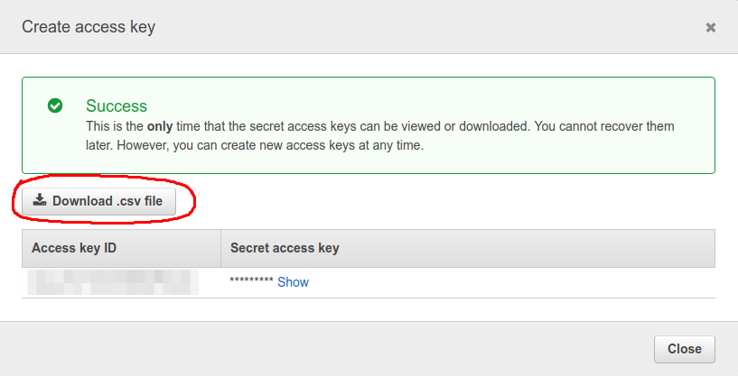
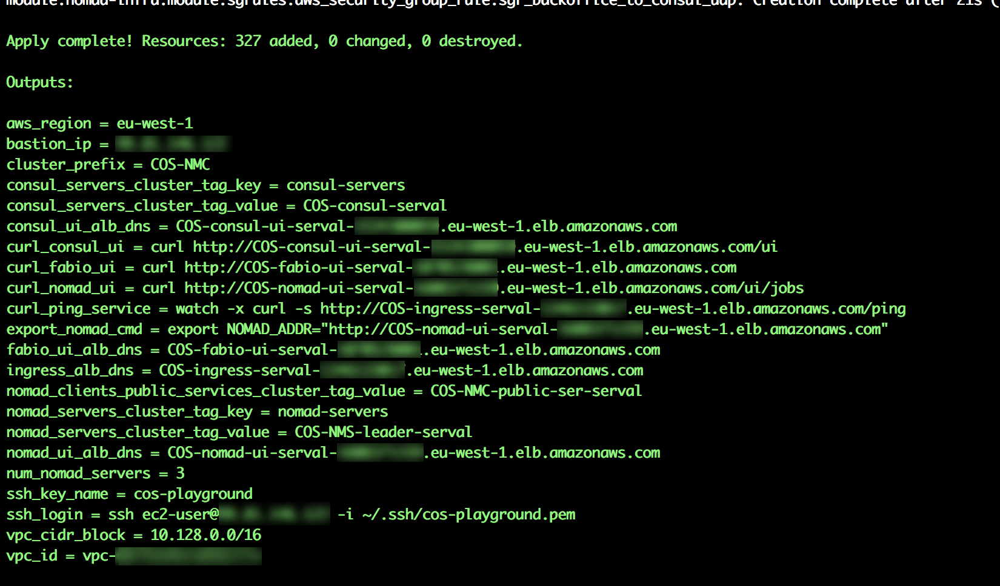
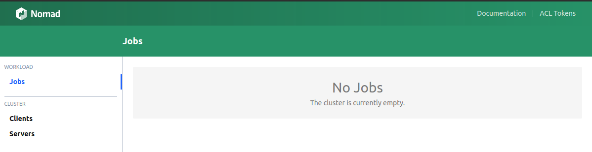
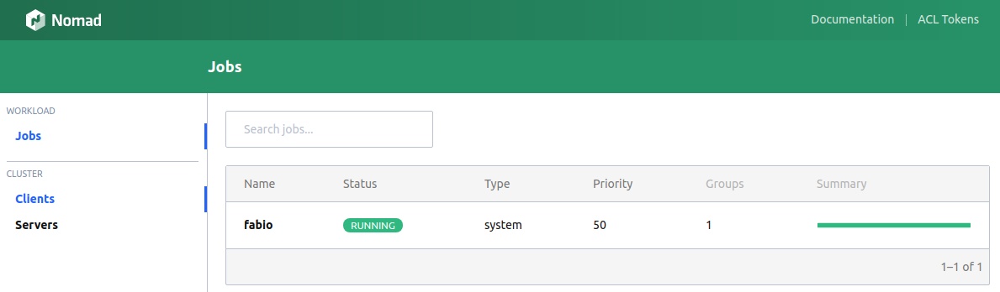
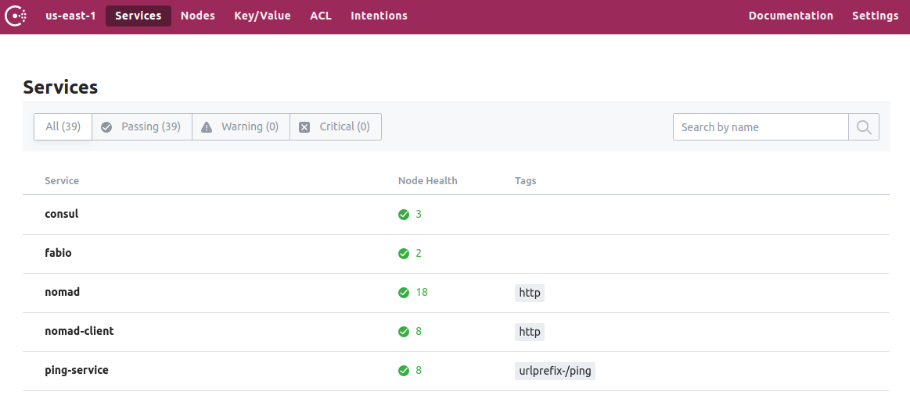

# Defining and Building a Container Orchestration System

In this paper I will be explaining why HashiCorp Nomad is a chosen core component of a cluster orchestration system, how the architecture of such a system could look like and discuss the components covering some of the most important topics like job scheduling, service discovery and load balancing/routing of ingress traffic.

Later I will show you how to set up the Container Orchestration System as it is I have outlined. The whole setup will be made using Terraform on an empty AWS account to ensure that it can be automated, reproduced and thus easily maintainable. The goal is to have a complete, [soup to nuts](https://en.wikipedia.org/wiki/Soup_to_nuts) platform where services can be deployed and managed easily.


## What a Container Orchestration System could look like

If you jumped on the containerization train, and dockerized your application components (ala, microservices) you are on a good path for a scalable and resilient system.

To really run such a system though, at production at scale the questions to be answered are:

 1. **Scheduling:** Where do these containers run?
 2. **Management:** Who manages their life cycle?
 3. **Service Discovery:** How do they find each other?
 4. **Load Balancing:** How to route requests?

After some research one quickly finds systems like [Kubernetes](https://kubernetes.io/), [DC/OS](https://dcos.io/), [AWS Elastic Container Service](https://docs.aws.amazon.com/AmazonECS/latest/developerguide/Welcome.html), [AWS EKS](https://aws.amazon.com/eks/) (An AWS managed kubernetes cluster), [Docker Swarm](https://github.com/docker/swarm/) and of this writing, probably a million more. Such systems are _kind of_ orchestrating the containers placement, communication and life cycle. The so called **Container Orchestration Systems** are responsible to manage containers and to abstract away the actual location they are running on.

All of these technologies have their advantages, disadvantages and of course a different feature sets. For example, DC/OS has really a big feature set, but it is very hard due to the learning curve to set up a production ready DC/OS cluster. Using kubernetes on Google Cloud is a good idea, but as soon as you want to spin it up on an AWS environment you will have a bad time.

These problems have vanished with AWS EKS, but since this service is relatively new there are important features that are missing. Additionally, and even more importantly, with AWS EKS you lose the option to run a hybrid multi-IaaS provider platform. With the abstraction you've gained by using containers there is lot of potential in offloading components on cheaper platforms like Microsoft Azure or even regional data centers. Thus looking at the costs it is a good idea to keep this option.


### Nomad as a Core-component

After looking at the mentioned Container Orchestration Systems there is one I would like to focus on, this is other product called [Nomad](https://www.nomadproject.io/). **Nomad is a scheduler of applications and services no more, no less.** Nomad can't, or should it compete with the feature sets provided by kubernetes or DC/OS. All the important features for managing and running services are available. It does _just_ one job but does it extremely well.

Other features like service discovery, load balancing, secret management, monitoring and logging are available open source and can be folded in easily to expand its capabilities.

Nomad is developed by [Hashicorp](https://www.hashicorp.com/), a company who's mantra is _"Consistent workflows to provision, secure, connect, and run any infrastructure for any application."_.


Having the bigger picture in mind, the Hashicorp engineers know exactly what the important components are, and how to implement these tools in a robust suite. Besides Nomad, they provide [Consul](https://www.consul.io/) (A Service Discovery and Connectivity tool), [Vault](https://www.hashicorp.com/products/vault/) (A Secrets as a Service tool) and [Terraform]() (An Infrastructure provisioning tool). All of them integrate with Nomad, layering in the missing features, such as service discovery to the Container Orchestration System to be set up.

To summarize - the most useful features that brought me to Nomad are:

 - **Complexity:** Nomad is easy to understand, therefore to set up and maintain.
 - **Job Control:** Nomad is a highly scalable scheduler using an _evaluation_ approach.
 - **Container/Task Support:** Docker, Rkt, simple binaries/executables and even bash scripts can be scheduled.
 - **Cloud Provider Agnostic:** Hybrid as well as multi-IaaS provider setup is possible.
 - **Extensibility:** Well thought out integration with other Hashicorp tools, to implement missing feature sets.
 - **Deployment:** Supports known deployment design patterns, such as rolling, canary and blue green.


### Architectural Overview



The core of our system  then will be Nomad. Nomad is able to deploy and manage services/applications on a fleet of compute instances (client nodes).

Nomad manages these in from a templating systems called [Nomad jobs](https://www.nomadproject.io/docs/job-specification/index.html). A **Nomad job** is either a single task or a group of tasks which, as said, can be a container (docker or rocket), a raw binary executable, a jar file or even a bash script. Such a job represents all the things that have to be deployed tightly together on the same client node.

Nomad itself is shipped as a simple binary that provides a server and a client mode. This binary is deployed on some type of compute instances (i.e AWS EC2) thus transforming these instances to Nomad server or client nodes.

At least three instances (a cluster quorum) with the Nomad binary in **server mode** per data center are used. This implementation leasds to a fault tolerant Nomad cluster across multiple availability zones. In the image above they are marked with the green Nomad logos. Using the [raft protocol](https://raft.github.io/) the server nodes elect a Nomad leader. The leader is then responsible management of all cluster calls and decisions.

Instances with the nomad binary in **client mode**, will be the nodes where the actual jobs are deployed and ran. In the image above these nodes are indicated by the smaller boxes.

Nomad also provides a feature called federation, which enables the option of connecting different Nomad clusters. Having this implemented the system can orchestrate and manage services across multiple data centers, which even can be hosted by different cloud providers. Indicated by the bold purple line in the architecural diagram, the Nomad leader of _Data-Center A (aka, eu-west-1)_ communicates with the leader in _Data-Center B (aka, eu-west-2)_ using [Serf](https://www.serf.io/) (A lightweight gossip protocol).


### Service Discovery



Beside Nomad, Consul will also be an essential part of our system, which gives the answer to two important questions:

 1. How do the Nomad server nodes find each other, and how do they know about the state and location of the client nodes?
 2. How can services find other services they will be need to communicate with?

The issue of the lack of service discovery is solved by implementing Consul. Consul knows the current health status and the location (IP and port, etc) of all registered services.

Just like Nomad, Consul is a single binary that can be ran in either server or client mode. The Consul agent in **server mode** is deployed to instances which are then transformed into the server nodes. In the architectural overview image, these nodes are marked with the purple consul icon. For fault tolerance at least three consul server nodes are deployed. They elect (like nomad does) a leader, that manages all cluster calls and decisions.

**Consul in client mode** runs on the remaining instances, which are the nomad server and nomad client nodes. Instead of contacting the consul server, each component directly communicates with the client that is locally available on each node. This removes the need to find out the actual location of the consul server.

Nomad and Consul are perfectly integrated, therefore the nomad nodes are able to find each other automatically using consul. Each node, either server or client, registers itself with consul then reports its health status. The nomad nodes are then promoted through the consul API as available nomad client or nomad service.

The same feature is applied for the jobs management by nomad. Nomad automatically registers a deployed job at consul. Thus all deployed services can be found by querying the consul API, which then returns the concrete IP, port and health status of the specific service.

This implies that each service has to implement code that queries the consul API. To avoid this effort there are components that can be used instead, like the load balancer [fabio](https://fabiolb.net/) or [envoy](https://www.envoyproxy.io/) which creates a service mesh.

To ease up the first setup, fabio will be used. Envoy will be introduced instead in an upcoming paper as it is a better solution for our purpose.


### Ingress Controller



As mentioned, fabio will be used for now as our load balancer and ingress traffic controller. Fabio integrates well with consul by implementing and leveraging consuls native API. Internally fabio has knowledge of consuls service catalog and thus about the state and location of the services registered with consul. Based on this knowledge fabio adjusts IP rules and routing tables on the specific nomad client nodes, this enables requests to be routed to the correct targets. It even works if the requested job lives on another instance, since the routes are based on IP and port.

This scenario is illustrated in the image above. Here the client requests a service represented by job A on nomad. After hitting the AWS ALB the request is routed to fabio, deployed as nomad job, which then forwards the request to job A. Either to the instance of job A on nomad client node 1 or 2.


## Setting up our Container Orchestration System

Now that we have outlined the technologies, lets roll out the big guns and start assembling the pieces to put our Container Orchestration System into action. As a note, all steps I will outline and scripts used here have been tested with an Ubuntu 16.04, but should also work on other linux based systems with minor tweaks and massages.




### Prerequisites

Before you can start with the rollout of the Container Orchestration System you need an AWS account, as well as the installation tools mentioned below.


#### AWS Account and Credentials Profile

Feel free to skip this account setup section if you already own or manage an AWS account.

The Container Orchestration System code is written in Terraform using the AWS services provider. You will need an AWS account to be able to deploy this system. To create a new account, just have to follow the tutorial: [Create and Activate an AWS Account](https://aws.amazon.com/premiumsupport/knowledge-center/create-and-activate-aws-account/).

Once you have an account, you will need to create AWS access keys using the AWS Web console:

 1. Login into your new AWS account.
 2. Create a new user for your account, by following this [tutorial](https://docs.aws.amazon.com/IAM/latest/UserGuide/id_users_create.html).
 3. Create a new access key for this user, by following this [tutorial](https://docs.aws.amazon.com/IAM/latest/UserGuide/id_credentials_access-keys.html#Using_CreateAccessKey).

Once the above steps are complete, don't forget to actually download your keys. This is the only time you can do this, so if you loose your keys you have to create a new keys following the same steps.



The downloaded file `accessKeys.csv` contains the `Access key ID` and the `Secret access key`.

Now that you have your keys, you can create an AWS profile. A profile in this context is just a name referencing access keys and some options for the AWS account in use. In order to use these, you'll have to create or modify the file `~/.aws/credentials`.

In this file, just add a new section named `my_cos_account` pasting in the `Access key ID`, the `Secret access key` and save the file.

```ini
[my_cos_account]
aws_access_key_id = PASTE HERE YOUR ACCESS KEY
aws_secret_access_key = PASTE HERE YOUR SECRET KEY
```

Now with your `my_cos_account` profile, you can use it to directly create the AWS resources that are needed to build up the Container Orchestration System.


#### Tools

Before we can really start to deploy the Container Orchestration System we'll have to install some essential tools.

**Terraform:** Is needed to create AWS resources. Here version **0.11.11** was used.

 - Download the binary from [Terraform Downloads](https://www.terraform.io/downloads.html).
 - Unzip and install it.

```bash
cd ~/Downloads
unzip terraform_0.11.11_linux_amd64.zip
sudo mkdir -p /opt/terraform/0.11.11
sudo mv terraform /opt/terraform/0.11.11

cd /usr/bin
sudo ln -s /opt/terraform/0.11.11/terraform terraform
```

 - Test it with `terraform --version`

**Nomad (CLI):** Is also needed to be able to deploy services into the Container Orchestration System and show the status of the Container Orchestration System. Here version **0.8.6** was used.

 - Download the binary from [Nomad Downloads](https://www.nomadproject.io/downloads.html)
 - Unzip and install it.

```bash
cd ~/Downloads
unzip nomad_0.8.6_linux_amd64.zip
sudo mkdir -p /opt/nomad/0.8.6
sudo mv nomad /opt/nomad/0.8.6

cd /usr/bin
sudo ln -s /opt/nomad/0.8.6/nomad nomad
```

 - Test it with `nomad --version`

**Packer:** Is needed to bake (create) the AWS AMI that contains the nomad binary, which is then actually used as image for the AWS EC2 instances that form the Container Orchestration System. Here version **1.3.3** was used.

 - Download the binary from [Packer Downloads](https://www.packer.io/downloads.html)
 - Unzip and install it.

```bash
cd ~/Downloads
unzip packer_1.3.5_linux_amd64.zip
sudo mkdir -p /opt/packer/1.3.5
sudo mv packer /opt/packer/1.3.5

cd /usr/bin
sudo ln -s /opt/packer/1.3.5/packer packer
```

 - Test it with `packer --version`


### Deployment

The whole setup consists of terraform code and is available at [Terraform: A Container Orchestration System](https://github.com/ehime/terraform-cos).
This project is designed as a Terraform module with a tailored API. It can be directly integrated into an existing infrastructure adding in a Container Orchestration System.

Additionally this project provides a self contained `root-example`, that deploys beside the Container Orchestration System with minimal networking infrastructure. This example will be used here to roll out the system.

The following steps will be required:

 1. Obtain the source code from github.
 2. Build the Machine Image (AMI) for the EC2 instances.
 3. Create an EC2 instance key pair.
 4. Deploy the infrastructure and the Container Orchestration System.
 5. Deploy fabio.
 6. Deploy a sample service.


### Clone your Codebase

```bash
# Create work folder
mkdir -p cos-example && cd $_

# Clone the code using tag v0.0.3
git clone --branch v1.0.1 https://github.com/ehime/terraform-cos .
```


### Build your Machine Image

You will need an instances of consul and nomad running in client and server mode running on a server. Luckily, both consul and nomad are shipped as binaries which can switch between these modes when called with different parameters. This leads to the situation where just one machine image will need to baked. This AMI will be our _Golden Image_ which contains both the Nomad and Consul binaries.

With this one AMI we will be able to have Instances that:

 - Have consul running in server mode with no nomad running. These are represent the **consul server nodes**.
 - Have consul running in client mode and nomad running in server mode. These are represent the **nomad server nodes**.
 - Have consul running in client mode and nomad running in client mode. These are represent the **nomad client nodes**.

To build our AMI, first Packer will need to be supplied with our AWS credentials. As described at [Packer Authentication](https://www.packer.io/docs/builders/amazon.html#authentication) you can use static, environment variables or shared credentials.

If you need a specicial user / permissions for Packer to have minimum impact you can use [this policy](https://gist.github.com/ehime/b945421fc49365c4f026d58c2c6a9e8d).


For now, I'll just be setting them in a shell by exporting the following parameters.

```bash
# AWS Environment Variables
export AWS_ACCESS_KEY_ID=<your access key id>
export AWS_SECRET_ACCESS_KEY=<your secret key>
export AWS_DEFAULT_REGION=eu-west-1
```

To build the AMI you just issue the following commands:

```bash
cd modules/ami2

# build the ami
packer build                   \
  -var 'aws_region=eu-west-1'  \
  -var 'ami_regions=eu-west-1' \
nomad-consul-docker.json
```

You should get the following results which specifies the ID of the AMI created.

```bash
==> amazon-linux-ami2: Deleting temporary keypair...
Build 'amazon-linux-ami2' finished.

==> Builds finished. The artifacts of successful builds are:
--> amazon-linux-ami2: AMIs were created:

eu-west-1: ami-1234567890xyz
```


### Create an EC2 Instance Key Pair

All instances of the Container Orchestration System will need to be accessed via ssh. So, during deployment an AWS instance key pair will be required.
This key can be created with the the name `cos-playground` for this example.

How to create a key pair is described at Creating a [Key Pair Using Amazon EC2](https://docs.aws.amazon.com/AWSEC2/latest/UserGuide/ec2-key-pairs.html#having-ec2-create-your-key-pair).


### Deploy the Container Orchestration System

For the deployment the `examples/root-example` will be used. It is self contained and builds not only the Container Orchestration System itself, but also the underlying networking infrastructure.

In this step you need the id of the AMI that was previously created and the name of your AWS profile. In our example the AMI id is `ami-1234567890xyz` and the profile is named `my_cos_account`.


```bash
cd ../examples/root-example

# create a new workspace to operate in
terraform workspace new cos_playground

# init terraform, download pugins and modules
terraform init

# a generic terraform plan call
# terraform plan -var nomad_ami_id_servers=<your ami-id> -var nomad_ami_id_clients=<your ami-id> -var deploy_profile=<your profile name> -out container-system.plan
terraform plan                                      \
  -var 'nomad_ami_id_servers=ami-02abc3480d8ecc9b7' \
  -var 'nomad_ami_id_clients=ami-02abc3480d8ecc9b7' \
  -var 'deploy_profile=my_cos_account'              \
-out container-system.plan

# apply the planned changes, which means deploy the Container Orchestration System
terraform apply container-system.plan -auto-approve
```

After successful deployment terraform prints some useful parameters to the terminal.



These can be used to open the Nomad UI `xdg-open "http://$(terraform output nomad_ui_alb_dns)"` or the Consul UI `xdg-open "http://$(terraform output consul_ui_alb_dns)"` in your browser. (**Note:** For OSX you can just use the `open` command as we don't have `xdg`)



The image above shows the web UI of the empty, but running nomad cluster.


### Deploying Fabio

Now having an empty system up and running the last missing part to complete the Container Orchestration System setup, is fabio as the ingress traffic controller. Fabio will be deployed as the first nomad job.

To interact with the nomad server you can make use of the nomad CLI locally installed on your computer. First you have to specify where the nomad CLI can find the nomad server by setting the environment variable `NOMAD_ADDR` appropriately.
This can be done by calling `cd examples/root-example && export NOMAD_ADDR=http://$(terraform output nomad_ui_alb_dns)`.
With `nomad server members` you should now get a list of three nomad servers, one of them elected as leader.

The nomad job description for deploying fabio is located at `examples/jobs/fabio.nomad`. It will roll out the raw binary of the reverse proxy, thus no docker job yet.


```hcl
job "fabio" {
  datacenters = ["`public-services`"]

  type = "system"
  update {
    stagger = "5s"
    max_parallel = 1
  }

  group "fabio" {
    task "fabio" {
      driver = "exec"
      config {
        command = "fabio-1.5.8-go1.10-linux_amd64"
      }

      artifact {
        source = "https://github.com/eBay/fabio/releases/download/v1.5.8/fabio-1.5.8-go1.10-linux_amd64"
      }

      resources {
        cpu = 500
        memory = 128
        network {
          mbits = 1

          port "http" {
            static = 9999
          }
          port "ui" {
            static = 9998s
          }
        }
      }
    }
  }
}
```

With `nomad run examples/jobs/fabio.nomad`, Fabio will be deployed to nomad to complete the Container Orchestration System setup.
To test if the deployment succeeded you can either open the fabio UI using `xdg-open "http://$(terraform output fabio_ui_alb_dns)"` or check the Nomad UI.



In the image above, Fabio running as nomad system job is shown. Thus the deployment was successful.

### Deploy a Sample Service

Also part of the Container Orchestration Sysgtems project at [Github](https://github.com/ehime/terraform-cos) is a nomad job description for deploying a sample service, the `ping-service`.

The `ping-service` is a simple service for testing purposes. When you send a request to it's endpoint, the service tries to forward this request to other instances of the `ping-service`. This is done for a defined number of hops or "pings". For each hop a "ping" is added to the response. The last receiver in the chain stops forwarding and adds a "pong" to concatenated message list.

So now lets deploy the `ping-service` and send a request against it.
By calling `nomad run examples/jobs/ping_service.nomad` four instances of the `ping-service` will be deployed to the Container Orchestration System.
Looking at consul one can see that beside, consul, nomad, nomad-clients and fabio also the `ping-service` is automatically registered by nomad. Thus the four deployed `ping-service` instances can be found via service discovery.

Each instance of the service runs in one of the four data centers of the Container Orchestration System, in `public-services`, `private-services`, `content-connector` or `backoffice data center`. More details about the available data centers can be found in the [Container Orchestration System Architecture](https://github.com/ehime/terraform-cos).



**Side note:** As you can see in the image, the tag `urlprefix-/ping` was added for the ping-service. This tag is needed to tell fabio to which service he should route all requests that hit the endpoint `/ping`. More details about this can be found at [fabio quickstart](https://fabiolb.net/quickstart/).

To test if the ping-service was deployed correctly, if he can find the other instances using the consul catalogue API and if fabio is able to route a request to a ping-service instance, you just have to send a GET request against the `/ping` endpoint.


```bash
# Obtain DNS name of the ingress ALB
export IGRESS_ALB=http://$(terraform output ingress_alb_dns)

# Send the test request once against the ping-service running in the COS
curl $IGRESS_ALB/ping
```

As a result you get something like:

```json
{
  "message": "/[private-services,v1]/[public-services,v1]/[content-connector,v1]/.../[content-connector,v1](PONG)",
  "name": "private-services",
  "version": "v1"
}
```

The field `name` denotes the data center of the ping-service instance that was hit first by the request (hop number one). In the message field you can see how the request propagates through the deployed instances of the service. From the private-services, to public-services, to content-connector, ..., to finally stop after 10 hops with the PONG message.

This test nicely shows that the service-discovery over consul and the request routing using fabio works as intended.


### Tear down

To avoid paying money for the AWS resources if you don’t use the COS any more you should tear it down.
With terraform this is really easy. The following command will remove all infrastructure components from your AWS account, but only those you created with terraform in this how-to.

```bash
cd examples/root-example

# destroy all infrastructure
terraform destroy -var 'deploy_profile=my_cos_account'

# clean up workspace
terraform workspace select default
terraform workspace delete -force cos_playground
```
